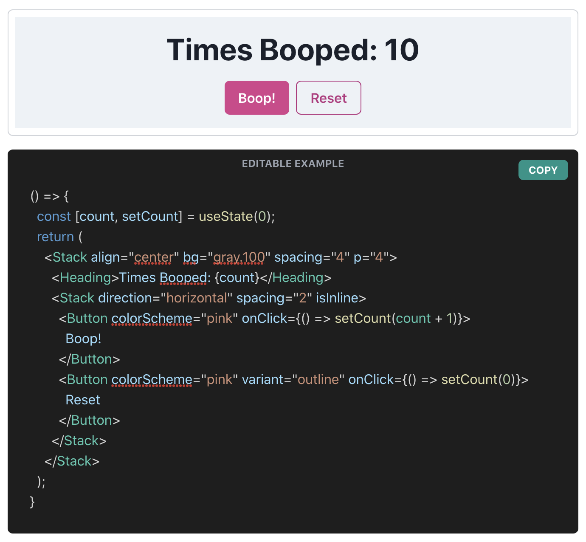

# Chakra UI Live Code Editor

## Overview

Live code editor from [Chakra UI](https://www.chakra-ui.com/), built using [React Live](https://github.com/FormidableLabs/react-live) and [TailwindCSS](https://tailwindcss.com/).

Watch the full tutorial video [here](https://youtu.be/Ld3W9aaNx1g)!

## How to run

This project is using [Next.js](https://nextjs.org/). Run it like any other Next app using `npm run dev`.

Make sure to run `npm ci` beforehand as well.

## License

Licensed under MIT License.
